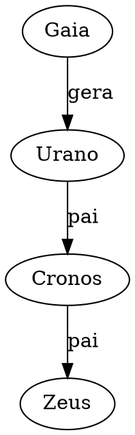

# Projeto Mitologia — Brief para iniciar no Codex

## 1. Objetivo do projeto

Transformar o atual diagrama `Mitologia grega.drawio` em uma base de conhecimento estruturada sobre mitologia grega.

A ideia central é deixar de manter o conhecimento apenas como um diagrama manual e passar a ter uma **fonte única da verdade**, da qual possam ser geradas várias visualizações:

- site navegável;
- diagramas em draw.io;
- grafos interativos;
- árvores genealógicas específicas;
- cronologias;
- exportações em JSON/CSV;
- SVG/PNG/PDF;
- futuramente, talvez uma API pública.

O draw.io deixa de ser a fonte principal e passa a ser uma **saída gerada** a partir dos dados.

---

## 2. Diagnóstico do estado atual

O arquivo atual `Mitologia grega.drawio` já é muito mais do que um simples mapa visual. Ele funciona como um grafo de conhecimento mitológico.

Características observadas:

- aproximadamente 987 formas/nós;
- aproximadamente 852 conexões;
- aproximadamente 840 rótulos textuais;
- uma página principal chamada `Página-1`;
- forte cobertura de cosmogonia, teogonia, genealogias divinas, linhagens reais, ciclos heroicos, monstros, eventos míticos e equivalências greco-romanas.

O diagrama é valioso como visão panorâmica, mas já está próximo do limite prático do draw.io como ferramenta de manutenção manual.

Principais limitações identificadas:

- muitas conexões cruzadas;
- manutenção manual trabalhosa;
- dificuldade de consulta;
- ausência de fonte bibliográfica estruturada por relação;
- mistura de dados, visualização e layout no mesmo arquivo;
- dificuldade para gerar subconjuntos: apenas Titãs, apenas Troia, apenas Héracles etc.

---

## 3. Decisão arquitetural principal

Usar um banco de dados relacional como fonte única da verdade.

Recomendação principal:

- **PostgreSQL** para versão robusta;
- **SQLite** para protótipo local simples.

Motivo: embora mitologia pareça naturalmente um grafo, a edição cotidiana tende a ser mais simples em tabelas relacionais. Um banco de grafos como Neo4j pode ser uma saída/exportação posterior, não necessariamente a fonte principal.

Arquitetura recomendada:

```text
Banco de dados relacional
        │
        ├── Site navegável
        ├── API
        ├── draw.io gerado
        ├── Graphviz/SVG
        ├── JSON/CSV
        ├── Cronologias
        └── Grafo interativo
```

---

## 4. Stack recomendada

### Banco de dados

- SQLite no início, para prototipagem local;
- PostgreSQL quando o projeto crescer.

### Backend

- Python;
- SQLAlchemy;
- Alembic para migrações;
- FastAPI para API.

### Frontend/site

- Next.js;
- React;
- TypeScript.

### Visualizações

- Cytoscape.js para grafo interativo no site;
- Graphviz para SVGs estáticos;
- geração de XML `.drawio` para exportação ao diagrams.net;
- Mermaid apenas para diagramas pequenos/documentação.

### Dados/importação

- Python para parsear o `.drawio` atual;
- scripts de importação para converter nós e conexões em tabelas;
- exportadores para JSON, CSV, Graphviz DOT e draw.io XML.

---

## 5. Modelo de dados inicial

### 5.1 Entidades

Tabela principal para personagens, deuses, monstros, grupos, lugares, eventos e objetos.

```sql
CREATE TABLE entities (
    id TEXT PRIMARY KEY,
    name TEXT NOT NULL,
    canonical_name TEXT,
    greek_name TEXT,
    roman_name TEXT,
    entity_type TEXT NOT NULL,
    gender TEXT,
    description TEXT,
    notes TEXT,
    created_at TIMESTAMP DEFAULT CURRENT_TIMESTAMP,
    updated_at TIMESTAMP DEFAULT CURRENT_TIMESTAMP
);
```

Tipos possíveis:

- primordial;
- titan;
- olympian;
- deity;
- hero;
- mortal;
- king;
- monster;
- nymph;
- muse;
- personification;
- group;
- place;
- event;
- object;
- constellation;
- source_work.

---

### 5.2 Relações

Tabela mais importante do projeto.

```sql
CREATE TABLE relationships (
    id TEXT PRIMARY KEY,
    source_entity_id TEXT NOT NULL REFERENCES entities(id),
    target_entity_id TEXT NOT NULL REFERENCES entities(id),
    relationship_type TEXT NOT NULL,
    certainty TEXT DEFAULT 'traditional',
    variant_group TEXT,
    notes TEXT,
    source_id TEXT REFERENCES sources(id),
    created_at TIMESTAMP DEFAULT CURRENT_TIMESTAMP,
    updated_at TIMESTAMP DEFAULT CURRENT_TIMESTAMP
);
```

Tipos de relação possíveis:

- parent_of;
- child_of;
- spouse_of;
- consort_of;
- sibling_of;
- killed_by;
- killed;
- founded;
- ruled;
- participated_in;
- associated_with;
- equivalent_to;
- transformed_into;
- born_from;
- imprisoned_in;
- lives_in;
- belongs_to_group;
- episode_of;
- appears_in;
- source_variant_of.

Observação: relações inversas podem ser geradas automaticamente. Por exemplo, se `Zeus parent_of Atena`, o sistema pode inferir `Atena child_of Zeus`.

---

### 5.3 Fontes

```sql
CREATE TABLE sources (
    id TEXT PRIMARY KEY,
    title TEXT NOT NULL,
    author TEXT,
    tradition TEXT,
    date_label TEXT,
    citation TEXT,
    url TEXT,
    notes TEXT
);
```

Exemplos:

- Hesíodo, Teogonia;
- Homero, Ilíada;
- Homero, Odisseia;
- Biblioteca de Apolodoro;
- Pausânias;
- Higino;
- Ovídio, Metamorfoses;
- tradição órfica;
- tradição romana.

---

### 5.4 Eventos

Eventos podem ser tratados como entidades de tipo `event`, mas talvez mereçam tabela auxiliar.

```sql
CREATE TABLE events (
    entity_id TEXT PRIMARY KEY REFERENCES entities(id),
    traditional_date_start TEXT,
    traditional_date_end TEXT,
    chronology_note TEXT
);
```

Exemplos:

- Titanomaquia;
- Gigantomaquia;
- Expedição dos Argonautas;
- Sete contra Tebas;
- Epígonos;
- Guerra de Troia;
- Retorno dos Heráclidas;
- Invasão dórica.

As datas míticas devem ser rotuladas como cronologia tradicional/lendária, não como história factual segura.

---

### 5.5 Nomes alternativos

```sql
CREATE TABLE aliases (
    id TEXT PRIMARY KEY,
    entity_id TEXT NOT NULL REFERENCES entities(id),
    alias TEXT NOT NULL,
    language TEXT,
    alias_type TEXT,
    notes TEXT
);
```

Exemplos:

- Zeus / Júpiter;
- Poseidon / Netuno;
- Hades / Plutão;
- Afrodite / Vênus;
- Héracles / Hércules;
- Odisseu / Ulisses.

---

### 5.6 Layouts gerados

Guardar parâmetros de layout quando necessário.

```sql
CREATE TABLE visual_layouts (
    id TEXT PRIMARY KEY,
    name TEXT NOT NULL,
    layout_type TEXT NOT NULL,
    config_json TEXT,
    created_at TIMESTAMP DEFAULT CURRENT_TIMESTAMP
);
```

Exemplos de layout:

- teogonia completa;
- filhos de Nix;
- descendentes de Gaia;
- família de Zeus;
- ciclo de Héracles;
- ciclo troiano;
- Odisseia;
- reis de Atenas;
- linhagem de Cadmo;
- monstros filhos de Tifão e Equidna.

---

## 6. Visualizações desejadas

### 6.1 Site

O site deve ter páginas automáticas para cada entidade.

Exemplo: página de Zeus

```text
Zeus

Descrição
Nomes alternativos
Pais
Irmãos
Consortes
Filhos
Domínios
Eventos relacionados
Lugares relacionados
Fontes
Variantes
Grafo local
```

Exemplo: página de Héracles

```text
Héracles

Descrição
Pais
Consortes
Filhos
Doze Trabalhos
Outros feitos
Inimigos mortos
Eventos relacionados
Fontes
Grafo local
```

---

### 6.2 Grafo interativo

Usar Cytoscape.js para:

- zoom;
- busca;
- filtros por tipo;
- filtros por relação;
- destacar vizinhança de um personagem;
- mostrar caminho entre duas entidades;
- ocultar categorias;
- alternar entre genealogia, eventos, equivalências e lugares.

---

### 6.3 Exportação draw.io

Gerar `.drawio` automaticamente a partir do banco.

O arquivo `.drawio` é XML. O gerador deve:

- criar nós como `mxCell`;
- criar conexões como `mxCell` com `edge=1`;
- aplicar estilos por tipo de entidade;
- aplicar cores por categoria;
- gerar páginas separadas por tema.

Páginas sugeridas:

- Cosmogonia;
- Titãs;
- Olímpicos;
- Filhos da Noite;
- Héracles;
- Argonautas;
- Tebas;
- Troia;
- Odisseia;
- Monstros;
- Cronologia mítica.

---

### 6.4 Graphviz

Gerar arquivos `.dot` para diagramas estáticos.

Exemplo:



---

### 6.5 Exportação JSON

Gerar API ou arquivo estático:

```json
{
  "entities": [],
  "relationships": [],
  "sources": []
}
```

Isso permite que o site funcione até como site estático inicialmente.

---

## 7. Itens faltantes identificados no diagrama atual

Prioridades de enriquecimento do conteúdo:

### 7.1 Musas individuais

O diagrama tem a categoria Musas e Calíope, mas deve completar:

- Clio;
- Erato;
- Euterpe;
- Melpômene;
- Polímnia/Polihímnia;
- Terpsícore;
- Talia;
- Urânia.

### 7.2 Filhos de Nix/Noite

Adicionar ou revisar:

- Moros;
- Ker/Kera;
- Keres;
- Oneiroi/Oniros;
- Oizys;
- Apate;
- Philotes/Filotes;
- Geras;
- Hespérides.

### 7.3 Doze Trabalhos de Héracles

Criar bloco sistemático com:

- Leão de Nemeia;
- Hidra de Lerna;
- Corça de Cerínia;
- Javali de Erimanto;
- Estábulos de Áugias;
- Aves do Estínfalo;
- Touro de Creta;
- Éguas de Diomedes;
- Cinto de Hipólita;
- Gado de Gerião;
- Maçãs das Hespérides;
- Cérbero.

Entidades associadas:

- Euristeu;
- Gerião;
- Ortros/Orto;
- Ládon;
- Hespérides;
- Augias;
- Hipólita;
- Diomedes da Trácia.

### 7.4 Odisseia

Adicionar ou revisar:

- Anticleia;
- Eumeu;
- Euricleia;
- Tirésias;
- Nausícaa;
- Alcínoo;
- Arete;
- Elpenor;
- Euríloco;
- Antínoo;
- Eurímaco;
- Cila;
- Caríbdis.

### 7.5 Ciclo troiano

Adicionar ou revisar:

- Andrômaca;
- Astíanax/Escamândrio;
- Briseida;
- Criseida;
- Laocoonte;
- Troilo;
- Polixena;
- Deífobo;
- Sarpédon;
- Glauco, se ainda não estiver corretamente distinguido.

### 7.6 Dionisíacos

Adicionar ou revisar:

- Sátiros;
- Mênades/Bacantes;
- Ampelo;
- Acrato/Acratus, opcional.

---

## 8. Correções sugeridas no conteúdo atual

Itens a revisar:

- `Tânato/Leto` provavelmente deveria ser `Tânato/Letum` ou `Tânato/Mors`; `Leto` é outra figura mitológica.
- `Hidra — Consstelação Hydra` deve virar `Hidra — Constelação Hydra`.
- `Pólux — Coinstelação Gemini` deve virar `Pólux — Constelação Gemini`.
- `Hiperiom` deve provavelmente virar `Hipérion`.
- Padronizar `Epigoni` para `Epígonos`, se o idioma principal for português.
- Padronizar idioma dos rótulos: `River gods` → `Deuses fluviais`, por exemplo.
- Identificar claramente quando uma relação vem de tradição grega, romana, órfica, hesiódica ou variante tardia.
- Rotular datas míticas como cronologia lendária/tradicional.

---

## 9. Estratégia de migração do draw.io atual

### Etapa 1 — Parser

Criar script Python para ler `Mitologia grega.drawio`.

Tarefas:

- parsear XML;
- extrair células `mxCell`;
- distinguir nós de arestas;
- extrair textos dos nós;
- extrair conexões por `source` e `target`;
- salvar resultado bruto em JSON.

Saída esperada:

```json
{
  "nodes": [
    {"id": "...", "label": "Zeus/Júpiter", "style": "...", "x": 10, "y": 20}
  ],
  "edges": [
    {"id": "...", "source": "...", "target": "...", "label": "pai"}
  ]
}
```

### Etapa 2 — Normalização

Transformar rótulos em entidades estruturadas.

Exemplos:

- `Zeus/Júpiter` → entidade principal `Zeus`, alias romano `Júpiter`;
- `Héracles/Hércules` → entidade principal `Héracles`, alias romano/latino `Hércules`;
- `Gaia/Terra` → entidade principal `Gaia`, alias `Terra`.

### Etapa 3 — Classificação

Classificar entidades por tipo.

Pode começar com regras manuais:

- primordiais;
- titãs;
- olímpicos;
- monstros;
- heróis;
- reis;
- eventos;
- lugares;
- grupos.

### Etapa 4 — Inserção no banco

Popular tabelas:

- entities;
- aliases;
- relationships;
- sources, inicialmente vazio ou genérico;
- visual_layouts.

### Etapa 5 — Exportadores

Criar exportadores:

- `export_json.py`;
- `export_graphviz.py`;
- `export_drawio.py`;
- `export_site_data.py`.

### Etapa 6 — Site

Criar site com:

- busca por entidade;
- página individual;
- grafo local;
- filtros por tipo;
- índice alfabético;
- cronologia;
- visualizações temáticas.

---

## 10. Estrutura inicial de repositório

```text
mitologia/

  README.md
  pyproject.toml
  .gitignore

  data/
    raw/
      Mitologia grega.drawio
    parsed/
      drawio_raw.json
    seed/
      entities.csv
      relationships.csv
      aliases.csv
      sources.csv

  scripts/
    parse_drawio.py
    normalize_entities.py
    seed_database.py
    export_json.py
    export_graphviz.py
    export_drawio.py

  backend/
    app/
      main.py
      db.py
      models.py
      schemas.py
      routers/
        entities.py
        relationships.py
        sources.py

  frontend/
    package.json
    src/
      app/
      components/
      lib/

  exports/
    drawio/
    graphviz/
    json/
    svg/
```

---

## 11. Primeiras tarefas para o Codex

### Tarefa 1

Criar um script `scripts/parse_drawio.py` que leia um arquivo `.drawio`, extraia nós, arestas, rótulos, estilos e coordenadas, e salve tudo em `data/parsed/drawio_raw.json`.

Critérios:

- aceitar caminho do arquivo via argumento CLI;
- preservar IDs originais do draw.io;
- distinguir células com `vertex=1` e `edge=1`;
- decodificar HTML simples dos rótulos;
- registrar coordenadas quando existirem;
- gerar JSON legível.

### Tarefa 2

Criar modelo SQLAlchemy com tabelas `entities`, `relationships`, `aliases`, `sources` e `visual_layouts`.

Critérios:

- usar SQLite por padrão;
- permitir migração futura para PostgreSQL;
- criar script de inicialização do banco;
- incluir tipos básicos de entidade e relação.

### Tarefa 3

Criar `scripts/normalize_entities.py` para transformar os nós extraídos do draw.io em entidades preliminares.

Critérios:

- separar aliases por `/`;
- limpar HTML;
- remover espaços duplicados;
- detectar possíveis equivalentes romanos;
- gerar `entities.csv` e `aliases.csv`.

### Tarefa 4

Criar `scripts/export_graphviz.py` para gerar um `.dot` a partir das entidades e relações.

Critérios:

- permitir filtro por tipo de entidade;
- permitir filtro por relação;
- gerar arquivo `.dot` válido;
- opcionalmente gerar SVG se Graphviz estiver instalado.

### Tarefa 5

Criar uma API FastAPI mínima.

Endpoints iniciais:

- `GET /entities`;
- `GET /entities/{id}`;
- `GET /entities/{id}/relationships`;
- `GET /relationships`;
- `GET /search?q=`.

### Tarefa 6

Criar site inicial em Next.js.

Páginas iniciais:

- `/` — página inicial;
- `/entities` — lista de entidades;
- `/entities/[id]` — página de entidade;
- `/graph` — visualização interativa com Cytoscape.js.

---

## 12. Prompt inicial sugerido para usar no Codex

Use este prompt no Codex:

```text
Quero iniciar um projeto chamado Mitologia. O objetivo é transformar um arquivo draw.io de mitologia grega em uma base de conhecimento estruturada, usando uma fonte única da verdade e gerando várias visualizações, incluindo site, JSON, Graphviz e futuramente draw.io.

Crie a estrutura inicial do repositório em Python, com scripts para parsear um arquivo .drawio, extrair nós e arestas, normalizar entidades e preparar dados para um banco SQLite.

Comece implementando:

1. scripts/parse_drawio.py
2. scripts/normalize_entities.py
3. backend/app/models.py com SQLAlchemy
4. backend/app/db.py
5. README.md com instruções de uso

Requisitos do parse_drawio.py:
- receber caminho do .drawio por argumento CLI;
- parsear XML;
- extrair mxCell com vertex=1 como nós;
- extrair mxCell com edge=1 como arestas;
- preservar id, value, style, parent, source, target;
- extrair mxGeometry com x, y, width, height quando disponível;
- decodificar HTML básico dos labels;
- salvar JSON em data/parsed/drawio_raw.json.

Requisitos do normalize_entities.py:
- ler data/parsed/drawio_raw.json;
- transformar labels em entidades preliminares;
- separar aliases por barras, por exemplo Zeus/Júpiter;
- gerar data/seed/entities.csv e data/seed/aliases.csv;
- manter o id original do draw.io como external_id.

Use código limpo, tipado quando possível, com funções pequenas e testes simples se viável.
```

---

## 13. Princípio orientador

O projeto não deve ser pensado como “fazer um diagrama maior”.

Ele deve ser pensado como:

> construir uma base de conhecimento mitológica estruturada, versionável, consultável e exportável.

O draw.io atual é o ponto de partida e também pode continuar como uma visualização importante, mas não deve continuar sendo a fonte primária dos dados.
